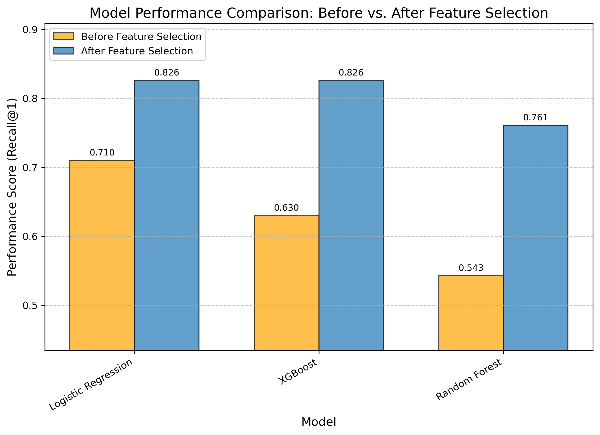

# 🏀 NBA MVP Prediction

Predicts the NBA Most Valuable Player of a season from player and team statistics. The pipeline covers data collection, preprocessing, dataset building, model training and evaluation, and compares several machine learning models.

<p align="center">
  
</p>

---

## 📦 Project Structure

- `scripts_raw_data/` → scripts for data download and cleaning
- `scripts_data_process/` → scripts for dataset preparation  
- `train_models.py` → train and evaluate different machine learning models  
- `hyperparameters_tuning/` → scripts for hyperparameter tuning and feature selection, along with results
- `models/` → trained models (ignored by Git) and results per model 
- `raw_data/`, `processed_data/`, `datasets` → data and datasets (ignored by Git)  
- `images/` → images for the project
- `env.yml` → environment for easy recreation with conda

---

## ⚙️ Installation

Clone the repository and make sure you have Python 3.9+ with the required dependencies (we recommend using conda):

`conda env create -f env.yml`

---

## 🚀 Usage

Use the project from `notebook.ipynb` by using the modules imported at the beginning of the document, by launching them with the main().

See below for some examples (not exhaustive, there are many more possibilities of parameters and modules to be used).

Note to future people: if you are using this project after 2026 and want to include new data,change the parameter `MAX_YEAR = 2026` in all the files before.

1. **Download and preprocess raw data**  
   ```
   r.main(1980, 2025)
   b.main()
   ```

2.	**Build datasets and split into train/test**
   ```
   pa80.main(1980, 2025)
   bs.main(["all1980"], 1980, 2025)
   ```

3.	**Train and evaluate models**
   ```
   t.main(model='logreg')
   ```

Available <model_name> options:

	•	logreg → Logistic Regression (Optimized)
 
	•	rf → Random Forest (Optimized)
 
	•	xgb → XGBoost (Optimized)
 
	•	gb → Gradient Boosting (Not Optimized)
 
	•	histgb → Histogram-based Gradient Boosting (Not Optimized)
 
	•	lgbm → LightGBM (Not Optimized)

4.	**Hyperparameter tuning (optional)**
   ```
   ht.main("logreg", "C", [1, 2, 3, 4, 5], combo={}, full=False)
   ```

5.	**Feature selection (optional)**
   ```
   gf.main(["all1980"],  "logreg", 2)
   gb.main(["all1980"],  "logreg", 2)
   ```

6. **Prediction**
   ```
   r.main(2026, 2026)
   pa80.main(2026, 2026)
   bs.main(["all1980"], 1980, 2026, 2026)
   pr.main("all1980", model="logreg", year=2026)
   ```

To make a prediction on the current year (on any year at all), use `pr.main("all1980", model="logreg", year=2026)`.

---

## Authors

Baptiste Pras and Eloi Beurtheret.
